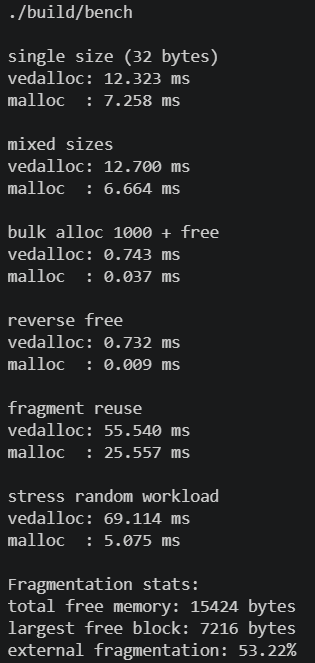
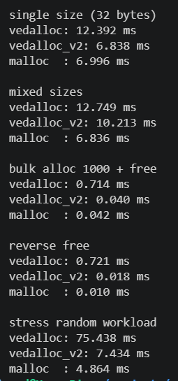

# Experimenting with Custom Memory allocators

My journey from **“what even is sbrk()?”** to “writing **slab allocators** with mmap and segregated free lists trying to **beat glibc malloc** in benchmarks.”

Turns out it’s mostly data structures, fragmentations, page mapping, and a lot of ugly tradeoffs. So, let's dive into the **"black magic"** of memory management.

### Resources I read
- Operating Systems: Three Easy Pieces Book (Must read)
- [Malloc is not magic](https://levelup.gitconnected.com/malloc-is-not-magic-implementing-my-own-memory-allocator-e0354e914402) (took inspiration for v1)
- [Writing Memory Allocator by Dan Luu](https://danluu.com/malloc-tutorial/)
- [mimalloc](https://github.com/microsoft/mimalloc) repo
- [tcmalloc](https://google.github.io/tcmalloc/overview.html) repo


## V1 - sbrk-Based Allocator

This was intentionally simple. Goal was not performance but rather understanding.

### It uses:

- sbrk() heap growth
- doubly linked list of blocks
- block splitting
- forward/backward coalescing
- first-fit allocation strategy

### Every block stores:

- whether it's allocated
- its size
- previous block
- next block

Basically a linked list heap.

### Heap Initialization

Allocator initializes one page using **sbrk()**, then creates one giant free block.So, the heap looks like:

```code
[ heap header ][ giant free block ]
```

### How Allocation Works

When allocating, it scans the linked list searching for a free block large enough which is called **First-Fit Allocation**, easy to implement but terrible scalability. As allocation becomes **O(n)**. Every allocation walks the heap.

### Block Splitting

Suppose allocator finds a 512-byte free block. You request 64 bytes. Instead of wasting 448 bytes allocator splits the block. Then creates a new free block. So:

```code
Before:
[512 FREE]

After:
[64 USED][448 FREE]
```

### Freeing Memory

Freeing is deceptively hard. You cannot just mark memory free forever because heap becomes fragmented. Example:

```code
[100 FREE][100 USED][100 FREE]
```

Now request **malloc(150)**. It fails. Even though total free memory = 200. This is **"external fragmentation"**.

### Coalescing

Solution: merge neighboring free blocks. This is called coalescing.

- **Forward Coalescing** - if next block is free, merge them.
- **Backward Coalescing** - merge previous free blocks. This matters because freeing order changes fragmentation behavior.

With both directions implemented, heap repairs itself much better.

## The Devastating Results in Benchmarks

Then I ran the benchmarks... and man, it was a reality check. Look at the screenshot, mine was significantly slower than malloc, and the external fragmentation was at 53.22%.



And honestly? That’s expected. Not failure.

### Why sbrk() Is Bad

- **sbrk()** grows the heap **linearly** which lead to global process heap contention, poor scalability, hard to return memory to OS, fragmentation nightmare.

- That's why it's deprecated on many systems. Modern allocators barely use it anymore. They prefer **mmap()** as pages can be independently mapped/unmapped.

### Problems in V1

1. Linear Traversal - Every allocation scanned linked list.

2. Coalescing Overhead - Every free potentially merges blocks. More pointer chasing.

3. Fragmentation - Linked list allocators fragment badly. My stress benchmark exposed this hard.

4. Repeated Heap Growth - Using sbrk() repeatedly introduces expensive heap extension behavior.

5. Cache Locality Was Terrible

### Then I Got Obsessed

At some point, I stopped trying to “make malloc”. I wanted to understand: why are production allocators designed the way they are? That completely changed the project.

**I went deep into:**
- slab allocators
- segregated free lists
- arenas, pools
- buddy allocators
- bump allocators
- size classes
- page allocators

**Some great allocator references:**

mimalloc technical docs
jemalloc wiki
tcmalloc design docs
Hoard allocator paper

And I realized **linked list + sbrk** was fundamentally the wrong direction if performance was the goal.

## The Redemption Arc

vedalloc V2 is where things became actually interesting.

### V2 design:

- slab allocators
- segregated size classes
- mmap-backed pages
- O(1) free lists
- no heap traversal
- no coalescing
- page-based allocation

### Core Idea

Instead of one giant linked list heap, V2 uses one allocator per size class.

```code 
size_classes[NUM_CLASSES] = {
    8, 16, 32, 64, 128, 256, 512, 1024
};
```

Now, 32-byte allocs go into 32-byte slabs, 64-byte allocs go into 64-byte slabs, which dramatically reduces fragmentation.

**Slab Allocation**

Allocator grabs an entire page, then slices page into fixed-size blocks. Every block same size. Cache friendly. No searching needed.

**Free Lists**

Each page stores a free list. Allocation just becomes pop head from linked list and Free becomes push block back. Literally O(1). No coalescing. No heap walking.

**Large Allocations**

Large allocations bypass slabs entirely. Handled using dedicated mmap regions and Freed using munmap()

### Why V2 Became Faster

- **O(1) allocation/free** - No heap traversal. No searching.
- **Better Cache Locality** - Fixed-size slabs pack memory tightly.
- **No Coalescing** - Completely removed coalescing overhead.
- **mmap() Instead of sbrk()** - Independent page management.
- **Segregated Size Classes** - Small allocs stop interfering with large ones.

## Now the Best Part - The Benchmarks

This was the first moment where things actually clicked. Benchmark implementation includes:
- single-size allocation
- mixed-size allocation
- bulk alloc/free
- reverse free
- stress random workloads



V2 actually **beat glibc malloc** in:
- single-size benchmark
- bulk alloc/free benchmark

Not everywhere. But enough to prove the design direction was correct.

### Did I actually beat malloc and how?

Yes. But context matters. **glibc malloc** is optimized for:
- multithreading
- security hardening
- fragmentation resistance
- decades of edge cases
- NUMA behavior
- concurrency
- production reliability

While malloc has to be a **"jack of all trades"**, vedalloc_v2 is a **stripped-down speed demon** for specific size classes. By using **mmap()** and a **free list**, I removed almost all the overhead.

## How To Run & Build

Wrote a Makefile to make testing easy. You can run the functional tests or the benchmarks yourself.

### Build the test executable

```bash
make
```

### Run tests

```bash
make run
```

### Build benchmark executable

```bash
make bench
```

### Run benchmark

```bash
make runbench
```

### Clean build files

```bash
make clean
```

